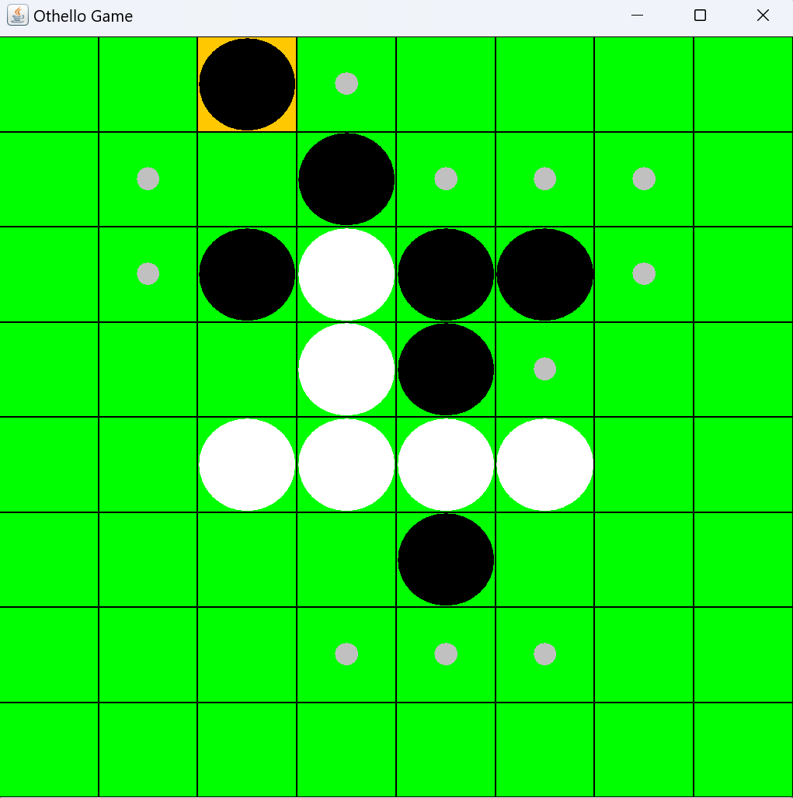
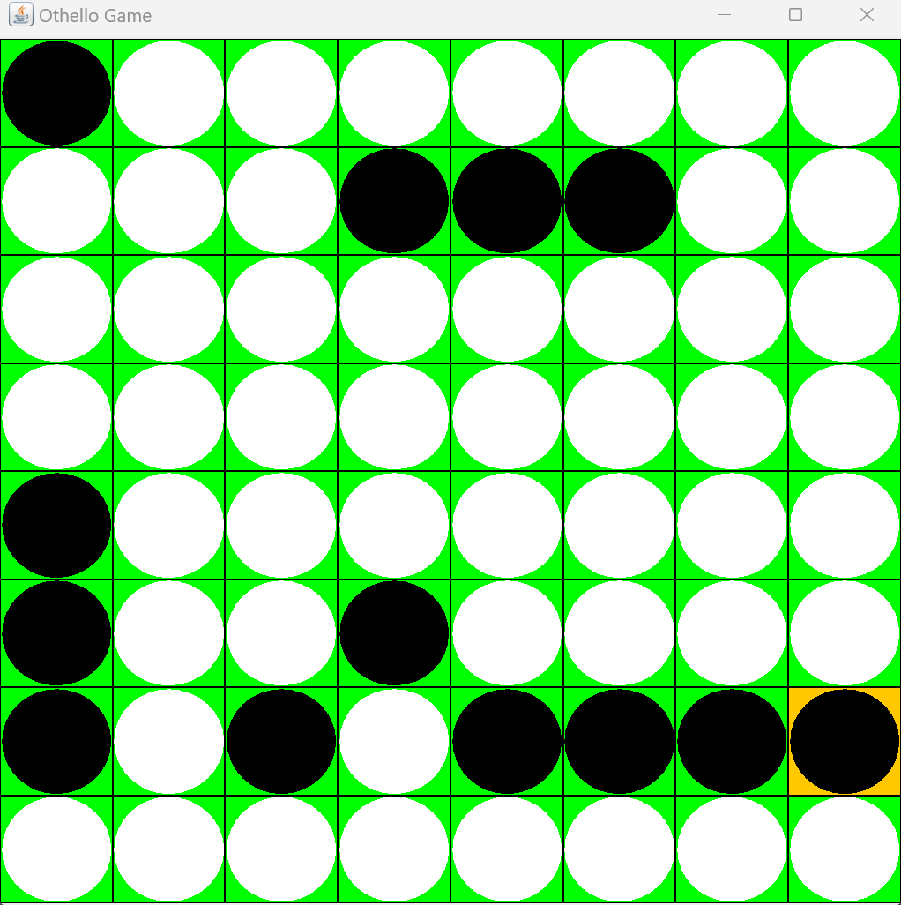

# Othello - Java
オセロをプレイするGUIアプリケーション。任意のサイズの盤面に対応している。また，コンピュータの最善手はNegascout法によって計算される。

## 工夫した点
- 評価関数
    評価関数は石数，角の数，辺上の石数，着手可能手数から計算されるようにしているが，経験則から以下の要素を考慮してそれらの重みを決めた。
    - 序盤は石数が少ない方が有利（→重みを序盤は負，終盤は正になるように設定）
    - 終盤は角と辺の重要度が下がる（→局面が進むと重みが下がるように設定）
    - 終盤は着手可能手数の重要度が上がる（→局面が進むと重みが上がるように設定）

    また，評価関数の値は盤面のサイズで正規化することで，盤面のサイズに依存しないようにした。
    他にも，8×8のオセロでは，よく知られた重みの数値があるが，任意のサイズの盤に対応させるため，不採用にした。

- 事前探索
    人間の番の間，人間側の各合法手に対してコンピュータの最善手を事前に計算することで，時間を有効に使い，その後のコンピュータの探索を効率化した。

## スクリーンショット

